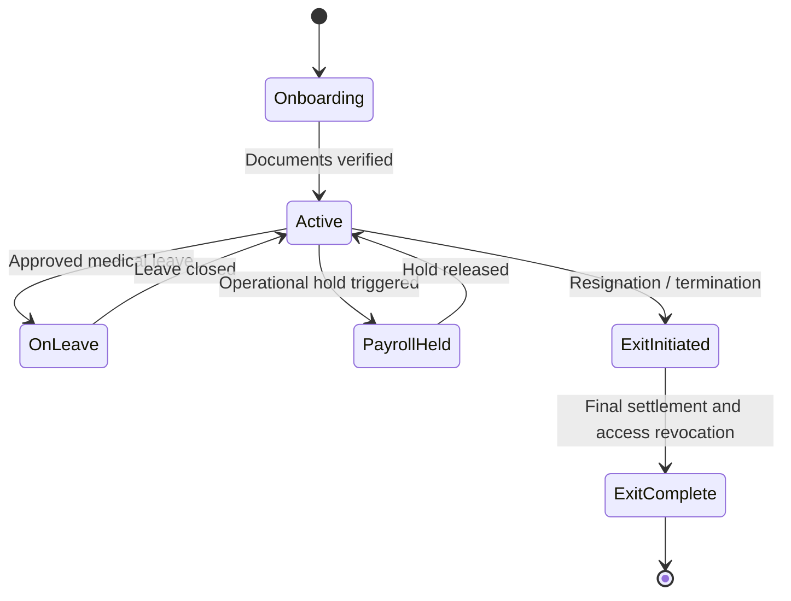
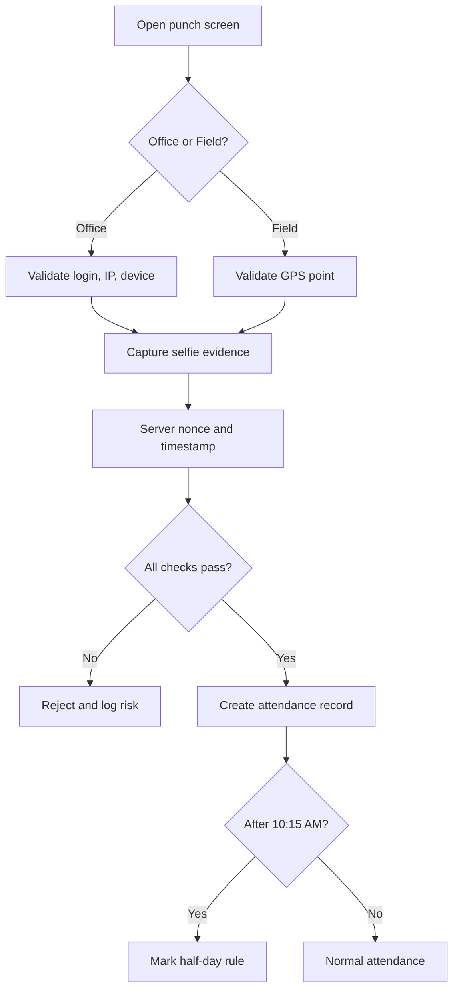
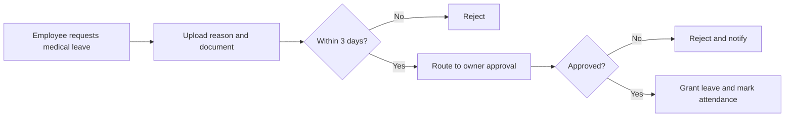
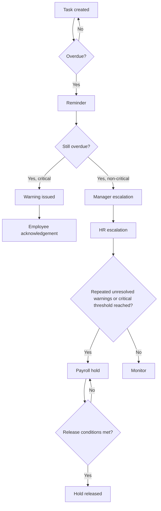
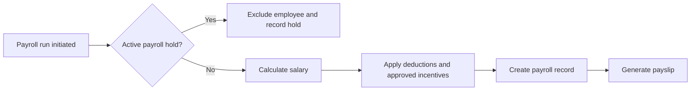
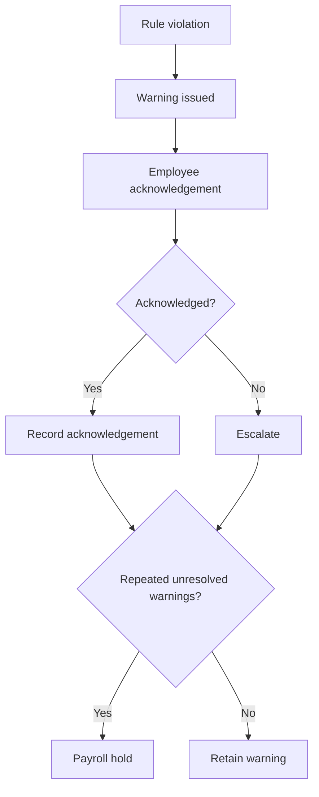
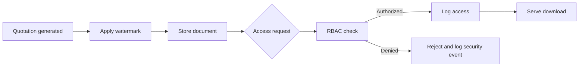
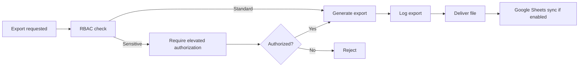

# ASHA BUILDERS ERP — Master Technical SRS

**Document ID:** ASHA_BUILDERS_ERP_MASTER_SRS.md  
**Status:** Canonical Business Specification  
**Purpose:** This document defines *what* the ERP must do.  
**Related Engineering Document:** `ENGINEERING_CONSTITUTION.md` defines *how* the ERP is built and *why* the engineering method is frozen.  
**Authority Rule:** If this document and the Engineering Constitution differ, the Master SRS wins for business requirements; the Engineering Constitution wins for engineering method. Neither may be silently contradicted.

---

## 0. Document Control

| Item | Detail |
|---|---|
| Prepared For | Asha Builders — Development and AI Implementation Team |
| Version | Master SRS v1 (consolidated from the recreated SRS plus approved requirement changes) |
| Source Basis | Technical SRS v2.0, approved scope refinements, Engineering Constitution |
| Delivery Model | Single-phase delivery for the full ERP scope |
| Initial Platform | Web dashboard + responsive PWA first; native apps later |
| Security Source | Security SRS is mandatory and applies to every module |
| Change Control | Any change requires an approved change request |

### 0.1 Document Hierarchy

1. Security SRS  
2. This Master SRS  
3. Engineering Constitution  
4. Module implementation plans  
5. Code and tests

### 0.2 Reconciliation Log

The final business scope reflected in this Master SRS includes the approved refinements discussed during the project:

- WhatsApp automation is removed from scope.
- Client, Broker, and Dealer portals are removed from scope.
- Attendance remains online-only.
- Task overdue behavior is stricter and can escalate into warnings and payroll holds.
- Leave is restricted to medical emergency leave with document upload and owner approval.
- Payroll governance is stricter and tied to task and warning compliance.
- Google Sheets remains reporting-only and never becomes an operational dependency.
- PostgreSQL remains the source of truth.

---

## 1. Vision

### 1.1 Why This ERP Exists

Asha Builders needs a single operational system that replaces informal control with auditable control.  
The ERP must make attendance, tasks, payroll, warnings, quotations, documents, reports, and approvals traceable by person, time, and rule.

### 1.2 Business Goals

- Eliminate proxy attendance and unverifiable field presence.
- Make task non-completion visible and consequential before it becomes a project delay.
- Protect payroll integrity.
- Protect quotation confidentiality.
- Give the Owner a single real-time view of the business.
- Preserve a complete audit trail for sensitive actions.

### 1.3 Product Philosophy

- The database is the source of truth.
- Google Sheets is a reporting mirror only.
- No downstream spreadsheet, chat message, or verbal instruction outranks recorded ERP data.
- If it is not in the database, it did not happen.

### 1.4 Scope Philosophy

This ERP is a business control system, not a generic CRUD app.  
Its primary purpose is operational discipline, accountability, payroll governance, data security, and owner visibility.

---

## 2. Business Overview

Asha Builders operates through interconnected business workflows:

- employee lifecycle and hierarchy management
- task accountability and escalation
- attendance verification and leave control
- daily EOD reporting
- warning and discipline tracking
- payroll governance
- performance analytics
- construction project tracking
- CRM lead pipeline and quotations
- inventory and material control
- vendor and contractor management
- accounts and manual payment tracking
- announcements, documents, exports, and audit logging

---

## 3. Locked Product Decisions

| Area | Confirmed Decision |
|---|---|
| Delivery | All approved modules are delivered in one coordinated ERP scope |
| Architecture | Modular monolith with strict module boundaries |
| Company Model | Single-company ERP with `company_id` retained internally |
| Payment Gateway | No online payment gateway |
| Manual Accounts | Manual payment entries and collection tracking retained |
| Attendance Platform | Web/PWA first with layered verification |
| 2FA | Mandatory for Owner, Admin, Accounts |
| File Policy | 25MB max per file; restricted file types |
| Offline Mode | Allowed for tasks, EOD, photos, and material entries; attendance remains online-only |

---

## 4. Roles, Designations, and Staff Types

### 4.1 System Roles

- Owner
- Admin
- HR Manager
- Accounts
- Manager
- Team Lead
- Employee
- Field Employee

### 4.2 Staff Types

- Office Employee
- Field Employee

### 4.3 Designation Examples

Designations are job positions, not security roles.

Examples:
- Project Manager
- Site Engineer
- Civil Engineer
- HR Executive
- Accountant
- Sales Executive
- Store Keeper
- QA/QC Engineer
- Supervisor
- Labour Coordinator

### 4.4 Permission Principle

Every endpoint checks:

- role
- department
- staff type
- team scope
- `company_id`
- owner-granted toggles

---

## 5. Functional Systems

### 5.1 Employee Management System

**Purpose:** Maintain the source of truth for employee identity, hierarchy, documents, status, and lifecycle.

**Responsibilities**
- employee profile creation and updates
- department and designation mapping
- reporting manager mapping
- status changes
- document records
- exit records

**Primary modules**
- Employee Management
- Recruitment and HR Pipeline
- Training and SOP Library

### 5.2 Task Accountability System

**Purpose:** Track work ownership, due dates, evidence, and escalation.

**Responsibilities**
- task creation and assignment
- priority and due date
- attachments and comments
- completion review
- overdue detection
- escalation chain
- history tracking

**Critical rule**
Overdue critical tasks must be capable of triggering warnings and payroll holds.

### 5.3 Attendance Verification System

**Purpose:** Verify presence through web/PWA attendance rules.

**Responsibilities**
- office punch verification
- field punch verification
- selfie evidence
- GPS evidence for field attendance
- correction audit
- attendance day accounting

**Critical rule**
Attendance is online-only.

### 5.4 Leave Management System

**Purpose:** Control approved leave and link it to attendance and payroll.

**Responsibilities**
- medical emergency leave requests
- document upload enforcement
- owner approval
- manager approval only when owner toggle allows
- attendance marking for approved leave

**Critical rule**
Only medical emergency leave is supported in the current scope. Maximum 3 days.

### 5.5 Daily EOD Reporting System

**Purpose:** Capture end-of-day work status, blockers, photos, and manager review.

**Responsibilities**
- daily report submission
- blocker reporting
- image upload
- manager comments
- escalation when needed

### 5.6 Warning & Discipline System

**Purpose:** Formal discipline tracking and repeat violation handling.

**Responsibilities**
- warning creation
- warning level assignment
- employee acknowledgement
- retention
- escalation to payroll hold when violations continue

### 5.7 Payroll Governance System

**Purpose:** Control salary calculation, deductions, holds, releases, and payslip generation.

**Responsibilities**
- 30-day salary base
- half-day deduction rules
- payroll hold detection and release
- payroll run governance
- payslip generation
- incentive inclusion when approved

**Critical rule**
Payroll must be blocked when task or warning conditions require it.

### 5.8 Performance Analytics System

**Purpose:** Aggregate task, attendance, EOD, and rating data into performance views.

**Responsibilities**
- performance scoring
- manager ratings
- trend views
- leaderboard-style views
- owner-facing summaries

### 5.9 Owner Command Dashboard

**Purpose:** Give the Owner a real-time command view of the business.

**Responsibilities**
- attendance counts
- overdue tasks
- payroll holds
- warnings
- pending approvals
- collection status
- site delays
- material alerts
- critical alerts

### 5.10 Audit and Compliance System

**Purpose:** Preserve a permanent record of sensitive actions.

**Responsibilities**
- audit trail
- deletion logging
- export logging
- document access logging
- legal export

### 5.11 Communication and Documents System

**Purpose:** Manage announcements, read receipts, documents, and access logging.

**Responsibilities**
- announcements
- announcement read receipts
- document registry
- document access logging
- document retention policies

### 5.12 CRM Lead Pipeline

**Purpose:** Track sales leads from capture to closure.

**Responsibilities**
- lead capture
- stages
- assignments
- follow-ups
- lost reasons
- quotation linkage

### 5.13 Incentive Announcements and Commission System

**Purpose:** Track public incentive announcements and payouts.

**Responsibilities**
- incentive announcements
- winner tracking
- payout tracking
- payroll feed

### 5.14 Construction Site Management System

**Purpose:** Track sites, phases, reports, QA, and delays.

**Responsibilities**
- sites
- site phases
- daily site reports
- progress notes
- blocker tracking
- photo progress history

### 5.15 Inventory and Material System

**Purpose:** Track stock, movement, shortages, and material discipline.

**Responsibilities**
- material inward logs
- stock updates
- wastage
- transfer logs
- shortages
- date-wise snapshots

### 5.16 Vendor and Contractor System

**Purpose:** Track vendor and contractor relationships.

**Responsibilities**
- profiles
- work orders
- payment references
- ratings
- blacklist

### 5.17 Accounts and Payment Tracking System

**Purpose:** Handle manual payment and collection tracking.

**Responsibilities**
- manual entries
- contractor/vendor payment schedules
- collection status
- client EMI schedule view
- expense records

### 5.18 Agreement Management System

**Purpose:** Track approvals and documents for agreements.

**Responsibilities**
- agreement creation
- multi-step approval
- archival
- controlled visibility

### 5.19 Payment Collection Tracker

**Purpose:** Track client payment schedules and collections.

**Responsibilities**
- EMI schedule
- collection entries
- outstanding status
- manual payment view

### 5.20 Project Profitability System

**Purpose:** Give owner and permitted users budget-vs-actual visibility.

**Responsibilities**
- project cost comparison
- P&L summaries
- budget vs actual reporting

### 5.21 Recruitment and HR Pipeline

**Purpose:** Manage hiring workflow.

**Responsibilities**
- jobs
- candidate tracking
- interviews
- offers
- hiring notes

### 5.22 Training and SOP Library

**Purpose:** Store SOPs and training acknowledgment.

**Responsibilities**
- SOP documents
- acknowledgments
- training records

### 5.23 Asset Management System

**Purpose:** Track company assets and assignments.

**Responsibilities**
- asset inventory
- issue/return
- repairs
- QR support

### 5.24 Meeting Management System

**Purpose:** Track meetings, minutes, and action items.

**Responsibilities**
- agenda
- MOM
- action items
- conversion to tasks

### 5.25 Customer Feedback and Complaints

**Purpose:** Track complaints and SLA resolution.

**Responsibilities**
- complaint intake
- SLA tracking
- resolution sign-off

### 5.26 Site Labour Management

**Purpose:** Track labour logs and contractor-wise billing.

**Responsibilities**
- daily labour logs
- monthly contractor bills

### 5.27 Photo Progress Timeline

**Purpose:** Preserve a visual timeline of project progress.

**Responsibilities**
- phase-wise visual history
- retention policy
- owner-controlled access

### 5.28 Reports and Analytics Center

**Purpose:** Produce PDF/Excel reports and scheduled reports.

**Responsibilities**
- report generation
- scheduling
- watermarked outputs where needed
- export logging

---

## 6. Removed from Scope

These are not part of the final business scope:

- WhatsApp automation
- Client portal
- Broker portal
- Dealer portal

These are not part of the ERP deliverable and must not be reintroduced without a change request.

---

## 7. Core Workflows

### 7.1 Employee Lifecycle

### 7.2 Attendance

### 7.3 Leave

### 7.4 Task Escalation to Payroll Hold

### 7.5 Payroll Run

### 7.6 Warning and Discipline

### 7.7 Quotation Security

### 7.8 Export and Reporting

---

## 8. Role Hierarchy

| Role | Access Summary |
|---|---|
| Owner | Full access across all modules, approvals, payroll overrides, deletions, exports, settings |
| Admin | System/backend administration only |
| HR Manager | Employee records, leave, payroll process, warnings, performance |
| Accounts | Manual payments, vendor/contractor tracker, expense processing, collection schedules |
| Manager | Own team tasks, attendance, leave approval if enabled, EOD, performance |
| Team Lead | Sub-team limited manager |
| Employee | Own tasks, attendance, leave, payslip, EOD, announcements |
| Field Employee | Employee with field attendance rules |

---

## 9. Permission Philosophy

Permissions are action-based.

Examples:
- `employee:create`
- `employee:update`
- `attendance:create`
- `attendance:approve`
- `leave:create`
- `leave:approve`
- `task:assign`
- `task:escalate`
- `payroll:process`
- `payroll:hold:create`
- `payroll:hold:release`
- `warning:issue`
- `warning:acknowledge`
- `export:sensitive`
- `audit:read`
- `quotation:download`

### 9.1 Scope Rules
- `own`
- `team`
- `all`

### 9.2 Owner Overrides
The Owner can grant or revoke specific operational permissions.

---

## 10. Data Model Groups

| Domain | Key Entities |
|---|---|
| Identity | companies, employees, refresh_tokens, device_registrations, two_factor_secrets, permission_grants |
| Attendance | office_locations, attendance_records, attendance_evidence, field_checkins, attendance_settings, attendance_corrections |
| Work | tasks, task_comments, task_attachments, task_history, eod_reports, escalation_rules, escalation_logs |
| Payroll | payroll_runs, payroll_records, payroll_components, payroll_feature_flags, payslips, incentive_announcements, incentive_awards |
| Accounts | payment_entries, payment_transactions, client_payment_schedules, client_payments, expense_claims, owner_expenses |
| CRM / Dealer / Broker | leads, lead_activities, dealers, dealer_visits, dealer_commissions, brokers, broker_commissions |
| Projects | sites, site_phases, site_reports, site_photos, material_inward_logs, inventory_items, inventory_transactions |
| Documents | documents, agreements, agreement_approvals, document_access_logs, report_exports |
| Security / Audit | audit_trail, security_events, api_logs, webhook_logs, login_attempts |

---

## 11. Security and Audit Rules

- Every protected API uses bearer authentication.
- All sensitive writes are server-validated.
- Every deletion is logged.
- Every sensitive export is logged.
- Every document access is logged.
- Payroll and quotation data are sensitive by default.
- Attendance evidence must be preserved for disputes.
- No sensitive data may be logged in plaintext.
- Company isolation applies everywhere.

---

## 12. Reporting and Export Rules

### 12.1 Google Sheets

Google Sheets is a reporting layer only.  
It must never become an operational dependency.

### 12.2 Supported Exports

- Attendance
- Tasks
- EOD reports
- Payroll summaries
- Collection reports
- Payment records
- Vendor reports
- Inventory reports
- Material reports
- Site reports
- CRM reports

### 12.3 Sensitive Export Requirements

Sensitive exports require:
- elevated authorization
- export logging
- download logging
- timestamp logging
- user logging
- audit logging

---

## 13. Background Jobs

| Job | Purpose |
|---|---|
| missing_punchout_check | Alert employee/manager for missing punch-out |
| task_overdue_check | Mark overdue tasks and trigger escalation |
| pending_task_warning | Show warning when pending tasks exceed threshold |
| holiday_weekly_off_sync | Apply configured holidays and weekly-off rules |
| photo_retention_cleanup | Delete non-permanent site photos per retention policy |
| attendance_selfie_cleanup | Delete selfies after 90 days while retaining attendance record |
| system_log_archive | Archive production logs to S3 |
| scheduled_reports | Generate and deliver configured reports |

---

## 14. Non-Functional Requirements

- Maintainability
- Auditability
- Scalability
- Reliability
- Data integrity
- Security
- Role-based access control
- Tenant isolation
- Consistent performance
- Clear module boundaries

---

## 15. Acceptance Criteria

### 15.1 ERP-wide

- All approved modules are implemented in the final delivery scope.
- Every query and file access is company-scoped and authorized.
- Task accountability escalates correctly into warning and payroll governance.
- Deletion is strictly audited and controlled.
- Sensitive exports are fully logged.
- Attendance and payroll rules match the approved requirements.
- The ERP delivers the business workflows required by Asha Builders.

### 15.2 Module-level

Each module must have:
- purpose
- valid workflow
- permissions
- business rules
- audit behavior where needed
- acceptance criteria
- failure cases

---

## 16. Traceability Matrix

| Requirement Area | Reference |
|---|---|
| Employee lifecycle | §7.1 |
| Attendance | §7.2 |
| Leave | §7.3 |
| Task escalation | §7.4 |
| Payroll | §7.5 |
| Warning and discipline | §7.6 |
| Quotation security | §7.7 |
| Export and reporting | §7.8 |
| Roles and permissions | §8–§9 |
| Data model | §10 |
| Security | §11 |
| Background jobs | §13 |
| Acceptance | §15 |

---

## 17. Appendix: Scope Clarifications

The following are explicitly out of scope and must not be reintroduced without a change request:

- WhatsApp automation
- Client portal
- Broker portal
- Dealer portal

This Master SRS is the business contract for the ERP.  
Engineering methods, projectors, outbox mechanics, replay behavior, and implementation constraints belong to the Engineering Constitution.
