# ASHA BUILDERS ERP — ENGINEERING CONSTITUTION
**The permanent engineering handbook for this system. Every developer and every AI agent — Claude, ChatGPT, Codex, OpenCode — reads this before touching the codebase.**

> **Authority chain:** `ASHA_BUILDERS_ERP_MASTER_SRS_v4.md` defines *what* this system does. This document defines *how* it is built, and *why*, so that it stays coherent across years of work by people and models who have never spoken to each other. Where this document and the Master SRS appear to disagree, the Master SRS wins on business requirements; this document wins on engineering method. Neither document may be silently contradicted — see §17.

---

## 1. Vision

### 1.1 Why This ERP Exists
Asha Builders currently runs on informal control: attendance enforced by trust, tasks tracked in chat threads, payroll decisions made by memory, quotations emailed without a record of who saw them. None of that scales past a certain headcount, and none of it survives a dispute — if a client questions a quotation, or an employee questions a payroll deduction, there is no system of record to settle it. This ERP exists to replace informal control with **enforced, auditable control**: every task has an owner and a deadline the system tracks, not a person; every payroll hold has a trigger and a release path the system logs, not a conversation; every quotation download is attributed, not anonymous.

### 1.2 Business Goals
- Eliminate proxy attendance and unverifiable field presence.
- Make task non-completion visible and consequential *before* it becomes a project delay.
- Protect payroll integrity — deductions and holds happen for auditable reasons, never informally.
- Protect quotation confidentiality — a leaked quotation is traceable to a person and a moment.
- Give the Owner one real-time view of the business instead of five disconnected ones.

### 1.3 Engineering Goals
- The system must still make sense to a new engineer — or a new AI agent with zero conversation history — in year seven, not just at launch.
- Every module must be independently auditable without holding the other 32 in working memory.
- Nothing sensitive (payroll, deletion, exports, quotations) may lack an audit trail, by construction, not by convention.

### 1.4 Product Philosophy
**The database is the source of truth.** Google Sheets is a reporting mirror, not an operational dependency (Master SRS §14). Nothing downstream — a manager's spreadsheet, a WhatsApp forward, a verbal instruction — outranks what is recorded in PostgreSQL. If it isn't in the database, it didn't happen.

---

## 2. Engineering Philosophy

| Principle | Why It Applies Here, Specifically |
| :--- | :--- |
| **Maintainability over speed** | This system enforces financial holds and disciplinary actions on real employees. A shortcut taken to hit a launch date becomes a liability the moment it's wrong about someone's salary. Debt in this codebase isn't abstract — it's a support ticket that involves HR and a paycheck. |
| **Correctness over quick delivery** | A bug in the Payroll Hold engine (§ Master SRS 9) doesn't just fail a test — it either wrongly withholds someone's pay or wrongly fails to enforce a real violation. Both are legal and trust exposures, not UI bugs. |
| **Architecture frozen before implementation** | Redesigning the Payroll Hold schema after `payroll_records` already has live, audited rows means migrating data under audit scrutiny. Freeze first; the cost of a wrong freeze is far lower than the cost of a live redesign. |
| **Scalability considered from day one** | Every entity carries `company_id` even though Asha Builders is a single company today (Master SRS §2). Retrofitting tenant isolation after the fact means touching every query in the system; including it from row one costs almost nothing. |
| **Auditability is mandatory** | `payroll_hold_logs`, `deletion_logs`, `export_logs`, `download_logs`, `warning_acknowledgements` — these aren't optional logging, they're the actual product for a business-control ERP. A feature that bypasses them isn't a shortcut, it's a defect. |
| **Every module independently understandable** | A future AI agent assigned to fix Warning & Discipline should not need to read Payroll Governance to safely change Warning code — they should only need to know Warning *emits an event* that Payroll *listens to*. See §5 (Domain Events) for how this boundary is enforced. |

---

## 3. Development Philosophy

The build order is not negotiable, and it is not a formality:

1. **Plan first.** Every module's data model and API contract is written down before a line of implementation code exists. Ambiguity resolved on paper costs a sentence; ambiguity resolved in code costs a migration.
2. **Freeze architecture.** Once a module's schema and event contracts are reviewed, they don't move for the duration of that build slice. If a flaw is found, it goes back through planning — it doesn't get patched live.
3. **Implement one slice.** A slice is one module, or one tightly-coupled cluster (e.g., Task + Warning + Payroll Hold, since they share an escalation chain). Never implement across unrelated modules in parallel without a merge plan.
4. **Test.** Unit tests for service logic, integration tests for cross-module event flows (a Task escalation must actually produce a Warning record; a Warning threshold must actually produce a Payroll Hold).
5. **Audit.** Every slice is reviewed against the Review Philosophy order (§16) before it's considered done — not just "does it work," but "does it match the SRS, is it secure, will it scale."
6. **Freeze.** Once audited, the slice is closed. Reopening it requires a new planning pass, not a quick patch — see §17, AI agents are explicitly forbidden from silently reopening frozen work.

**Why never redesign during implementation:** a mid-implementation redesign means the plan that was reviewed is no longer the plan being built. Nobody re-reviewed the new version. This is precisely how architectural drift enters a 10-year system — not through one bad decision, but through a hundred small unreviewed deviations from a plan that looked fine on paper.

---

## 4. Software Engineering Principles

| Principle | Application in This ERP |
| :--- | :--- |
| **Single Responsibility** | A `TaskService` decides whether a task is overdue. It does not decide whether that triggers a Warning — that's `WarningService`'s job, reacting to a `TaskOverdue` event. If one service starts making the other's decisions, the boundary has failed. |
| **Open/Closed** | Adding a new Warning category (e.g., "Safety Violation" on a construction site) should be a data change (new enum value + config), not a code change to the escalation engine itself. |
| **Liskov Substitution** | `FieldEmployee` extends `Employee` attendance rules (GPS+selfie) without breaking any code written against the base `Employee` attendance contract. Attendance verification code should never need to type-check "is this a field employee" outside the Attendance module itself. |
| **Interface Segregation** | `PayrollService` should not be forced to depend on the full `TaskService` interface just to read overdue-task counts — it depends on a narrow `TaskAccountabilitySnapshot` interface, decoupling payroll from task internals. |
| **Dependency Inversion** | Services depend on repository *interfaces*, not concrete Prisma calls, so the audit/event-sourcing layer can be swapped or extended (e.g., adding a projector) without touching business logic. |
| **KISS** | The escalation chain is a single linear state machine (Reminder → Warning → Manager → HR → Payroll Hold), not a rules engine with arbitrary branching. Resist the urge to make it "configurable" beyond what the SRS actually asks for. |
| **DRY** | Ownership/`company_id` filtering logic lives once, in the repository base layer — not copy-pasted into 33 modules' worth of queries. A single missed filter is a tenant-isolation breach. |
| **YAGNI** | Feature-flagged payroll components (PF/ESI/TDS/overtime, Master SRS R2) are the one deliberate exception — build the schema seat now because the cost asymmetry favors it, not because "we might need it." Don't extend this reasoning to other speculative features. |
| **Composition over Inheritance** | Role behavior (Manager vs Team Lead vs HR) is composed from permission grants and scope filters, not from a deep class hierarchy of role subclasses. A new role should be a new set of grants, not a new class. |
| **Fail Fast** | An attendance punch missing a required GPS point for a Field Employee is rejected at the API boundary with a clear validation error — it does not get silently recorded as "unknown location" and discovered three weeks later during a payroll dispute. |
| **Defensive Programming** | Every write to `payroll_records`, `warnings`, or `deletion_logs` assumes the caller might be compromised or wrong, and re-validates ownership/`company_id`/role server-side — never trusts a client-supplied ID without checking it belongs to the acting user's scope. |
| **Immutability** | `attendance_records`, `payroll_hold_logs`, and `audit_trail` rows are never updated in place. A correction is a new row referencing the old one (see §11, Append-Only Architecture) — the original is preserved for audit. |
| **Idempotency** | The `task_overdue_escalation` cron (every 15 minutes) must not double-escalate a task if it runs twice in overlapping windows. Each escalation step is keyed by `(task_id, escalation_stage)` so re-running the job is a no-op if that stage is already recorded. |
| **Event-Driven Design** | A `TaskOverdue` event is the only channel through which the Task module tells the Warning module something happened. Task never writes directly to the `warnings` table. |
| **CQRS** | The Owner Dashboard reads from denormalized projections (overdue task counts, active hold counts) rather than running live aggregate queries across 8 tables on every page load. See §15. |
| **Append-Only Architecture** | Warnings, payroll holds, deletions, and exports are never deleted or overwritten — they are superseded by new rows. This is what makes the audit trail trustworthy: nobody, including Admin, can quietly erase history. |
| **Replayability** | Because state changes are events, a projection (e.g., the Owner Dashboard's "active holds" count) can be rebuilt from the event log if it drifts — this is the safety net for CQRS read-model bugs. |
| **Transaction Safety** | A Payroll Hold triggered by a Warning threshold and the Warning record itself that caused it must commit together or not at all — a partial write here means a hold with no traceable cause, which defeats the entire audit purpose of the feature. |
| **Consistency & Atomicity** | Enforced at the database transaction boundary for same-aggregate writes (e.g., a `Task` status change and its `task_history` row); enforced via the Outbox pattern for cross-module effects (see §5). |
| **Layered Architecture** | Controller → Service → Repository, strictly one-directional. A Repository never calls a Service. A Controller never touches Prisma directly. This is what makes each module readable in isolation (§2.5). |

---

## 5. Architecture Philosophy

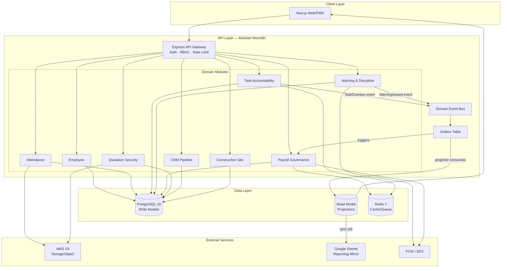

| Concept | Why It Exists Here |
| :--- | :--- |
| **Modular Monolith** | 33 modules, one deployable, one database — chosen over microservices because the team is small, the modules are highly interdependent (Task→Warning→Payroll is a single business process split across "modules" only for code organization), and network-call overhead between them would add failure modes with no present benefit. See ADR-01. |
| **Future Microservice Extraction** | Module boundaries (Controller/Service/Repository, event-only cross-module contact) are drawn *as if* each module could become a service later — because eventually Attendance (high write volume) or Payroll (compliance-sensitive) plausibly will. The boundary discipline is what makes that extraction possible without a rewrite. |
| **CQRS** | Owner Dashboard, GSheets exports, and Performance Analytics all read aggregated, denormalized data that would be expensive to compute live from write-optimized tables. Reads and writes are allowed to have different shapes. |
| **Domain Events** | The mechanism by which modules stay decoupled. Task doesn't know Warning exists; it just emits `TaskOverdue`. Warning doesn't know Payroll exists; it emits `WarningThresholdBreached`. This is what makes §2.5 (independent module understandability) actually true rather than aspirational. |
| **Outbox** | A domain event and the database write that caused it must be atomic, or a crash between "write task status" and "publish event" silently loses an escalation step. The Outbox table is written in the same transaction as the business write, then a separate relay publishes it — guaranteeing at-least-once delivery without a distributed transaction. |
| **Projectors** | Consume events from the Outbox and build read models (dashboard counts, GSheets export snapshots). If a projector has a bug, it can be fixed and *replayed* against the event log — it never touches the write-model source of truth. |
| **Replay** | The reason events are never deleted. If the Owner Dashboard's "active payroll holds" counter drifts from reality, replaying the event log from a checkpoint rebuilds it correctly — this is the actual safety net, not a theoretical one. |
| **RBAC** | Every endpoint checks role + department + staff_type + team scope + `company_id` + Owner-granted toggle (Master SRS §4) before any read or write. This is enforced in a shared middleware, not per-controller, so it cannot be forgotten module-by-module. |
| **Approval Engine** | A single reusable workflow primitive (submit → approve chain → SLA escalation) backing Leave, Expense, Payroll Hold Release, and Agreement approvals — built once, configured per module, not reimplemented four times with four sets of bugs. |
| **StorageObject** | A single abstraction over "a file that was uploaded, belongs to someone, has a retention policy, and is logged when accessed" — backing selfies, quotation PDFs, site photos, and documents uniformly, so file security (Master SRS §13) is enforced in one place, not scattered across modules. |
| **Audit** | Not a module — a cross-cutting service every other module calls. `audit_trail` (restored per Master SRS R3) is the ledger every sensitive action writes to, regardless of which of the 33 modules initiated it. |
| **Scheduler** | Owns all cron jobs (Master SRS §19) — `task_overdue_escalation`, `payroll` deduction runs, cleanup jobs — as a single coordinated service so overlapping runs can be reasoned about and made idempotent in one place, not 8 different places. |
| **Read Models / Write Models** | Write models (`tasks`, `warnings`, `payroll_holds`) are normalized and transactionally strict. Read models (dashboard projections, GSheets snapshots) are denormalized and eventually consistent. Conflating the two is what makes dashboards slow *and* payroll writes unsafe — keeping them separate fixes both. |
| **Projection Ownership** | Exactly one projector writes to a given read model. If two projectors could write to "active holds count," a race condition produces a silently wrong number the Owner trusts. |
| **Single Writer Principle** | For any given table, exactly one service is allowed to write to it. `payroll_holds` is written only by `PayrollService`, even though `TaskService` and `WarningService` are what trigger holds — they trigger it via an event, `PayrollService` performs the write. This is the concrete mechanism behind Single Responsibility (§4). |

---

## 6. Business Systems

| System | Purpose | Responsibilities | Depends On | Owns |
| :--- | :--- | :--- | :--- | :--- |
| **HRMS** (Employee Mgmt, Recruitment, Training) | System of record for who works here and their lifecycle | Profiles, hierarchy, onboarding, exit, recruitment pipeline, SOP acknowledgement | Identity/Auth | `employees`, `job_postings`, `sop_acknowledgements` |
| **EMS / Task Accountability** | Operational discipline mechanism | Assignment, priority, evidence, escalation chain | Employee, Notifications | `tasks`, `task_history`, `task_attachments` |
| **Attendance** | Verified presence record | Punch verification, correction audit | Identity, StorageObject (selfies) | `attendance_records`, `field_checkins` |
| **Payroll Governance** | Financial integrity + compliance enforcement | Calculation, holds, releases, feature-flagged components | Task, Warning, Attendance (all feed hold triggers) | `payroll_runs`, `payroll_holds` |
| **Warning & Discipline** | Formal HR consequence mechanism | Categorized warnings, acknowledgements, permanent retention | Task, Employee | `warnings`, `warning_acknowledgements` |
| **Construction Site Mgmt** | Physical project tracking | Sites, phases, daily reports, QA, delay tracking | EOD, Task, StorageObject | `sites`, `site_phases`, `site_reports` |
| **CRM Lead Pipeline** | Sales funnel | Lead capture, stages, follow-ups | Employee (assignment) | `leads`, `lead_activities` |
| **Quotation Security** | Confidentiality of sensitive commercial documents | Watermarking, access/download logging | CRM, StorageObject, Audit | `quotations`, `quotation_access_logs` |
| **Inventory & Vendor** | Material and supplier control | Stock, wastage, vendor ratings, blacklist | Site, Accounts | `inventory_items`, `vendors` |
| **Communication & Docs** | Internal broadcast + document control | Announcements, read receipts | Employee | `documents`, `announcements` |
| **Performance Analytics** | Aggregated evaluation signal | Task/attendance/EOD/rating trend rollups (read-model only, see §15) | Task, Attendance, EOD | Projections only — no write authority |
| **Owner Command Dashboard** | Real-time visibility layer | Aggregation and display (read-model only) | All hold/warning/task/collection producers | Projections only |
| **Audit & Compliance** | Cross-cutting ledger | Append-only record of every sensitive action | Every module (write-only inbound) | `audit_trail`, `deletion_logs` |
| **GSheets Export Framework** | External reporting mirror | RBAC-filtered dataset push, logging | Read models, Audit | `export_logs`, `download_logs` |

**Boundary rule that applies to all of the above:** a module may only be the write-owner of its own tables. Cross-module state changes happen through domain events (§5), never direct foreign writes. Performance Analytics and the Owner Dashboard are explicitly **read-only aggregators** — they do not own any write model, precisely so that a dashboard bug can never corrupt operational data.

---

## 7. Complete Business Workflows

### 7.1 Employee Lifecycle
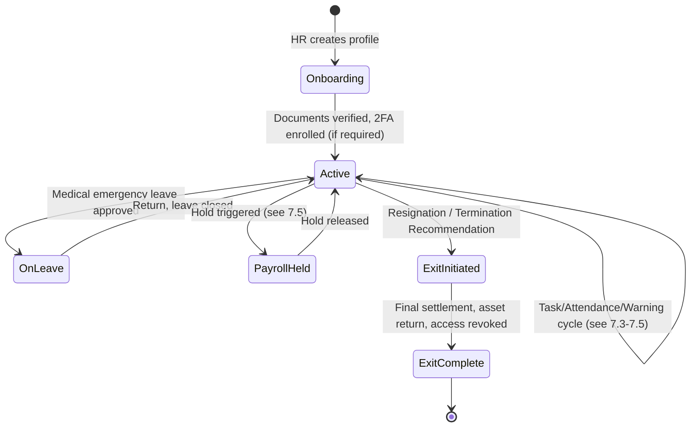

### 7.2 Attendance
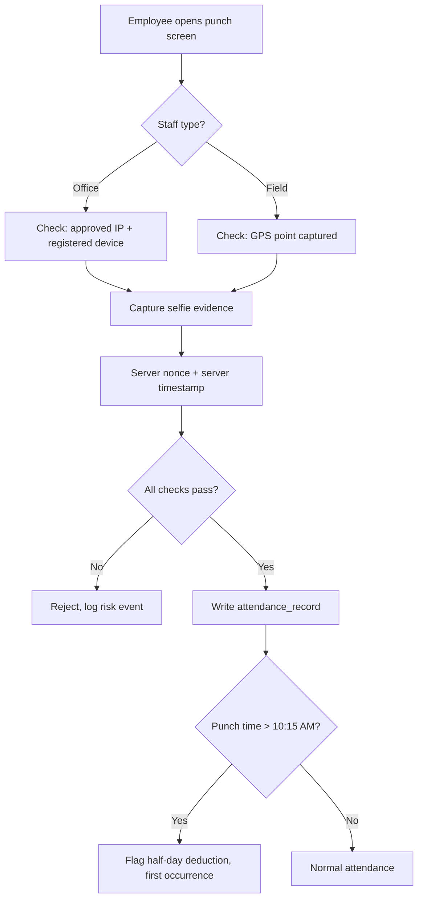

### 7.3 Leave
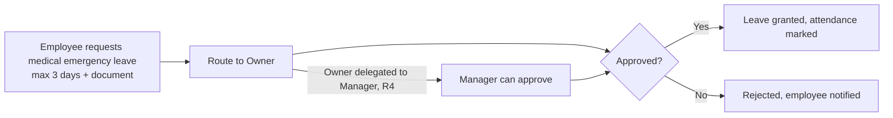

### 7.4 Task Escalation → Warning → Payroll Hold
*(the single most important cross-module flow in this system — implement this exactly, do not simplify it)*
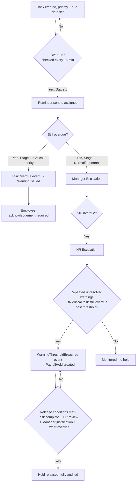

### 7.5 Payroll Run
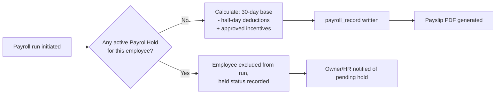

### 7.6 Warning & Discipline
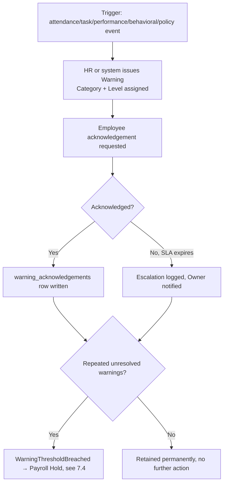

### 7.7 Quotation Security (CRM)
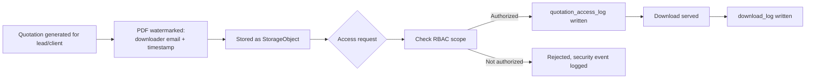

### 7.8 Construction Site Reporting
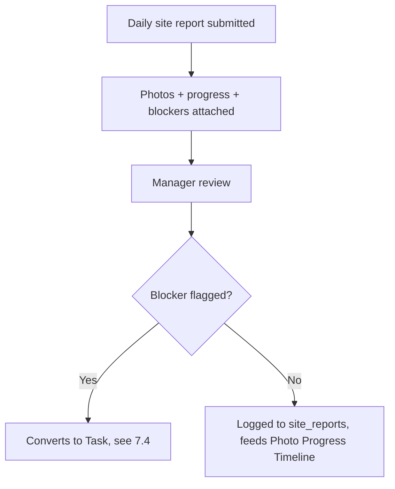

### 7.9 Generic Approval Workflow
*(backs Leave, Expense, Agreement, Payroll Hold Release — one engine, four configurations)*
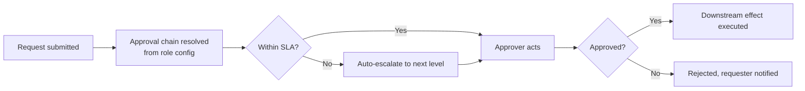

### 7.10 Export & Data Access
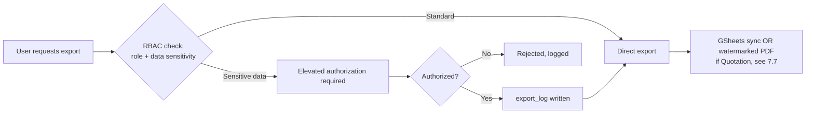

---

## 8. Role Hierarchy

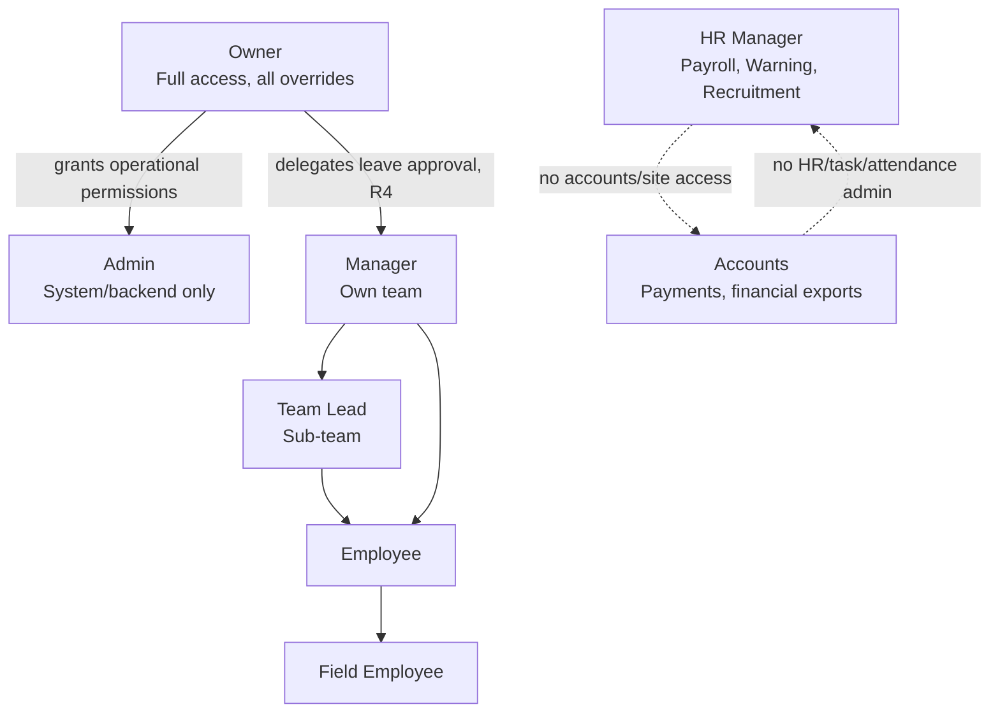

Reporting hierarchy is org-structural (Manager → Team Lead → Employee) and is **separate from module permission scope** — a Team Lead's *reporting* authority over their sub-team does not imply payroll or expense-approval authority (Master SRS §4 explicitly excludes both). Department Hierarchy (HR, Accounts, Operations, Construction) governs data visibility scope for exports and dashboards; Staff Type (Office / Field) governs attendance rule set only and is orthogonal to role.

---

## 9. Permission Philosophy

**Permissions are action-based, never role-hardcoded in business logic.** A service checks `can(user, 'task:escalate:critical')`, never `if (user.role === 'HR')`. Roles are just named bundles of action grants — this is what lets Owner grant a one-off operational permission to Admin (Master SRS §4) without a code change.

**Naming convention:** `<module>:<action>:<scope?>` — e.g. `payroll:hold:release`, `export:sensitive:payroll`, `quotation:download:own`. Scope suffixes (`own`, `team`, `all`) are explicit, never implied by role alone, because the same role (Manager) has `team` scope on tasks but `own` scope on payroll.

| Permission Group | Example Grants |
| :--- | :--- |
| `payroll:*` | `payroll:hold:create`, `payroll:hold:release`, `payroll:view:own`, `payroll:view:team` (Accounts: view only, never `process`) |
| `warning:*` | `warning:issue`, `warning:acknowledge`, `warning:view:all` (HR, Owner only) |
| `task:*` | `task:assign:team`, `task:escalate`, `task:complete:own` |
| `export:*` | `export:standard`, `export:sensitive` (requires elevated auth, Master SRS §14) |
| `deletion:*` | `deletion:authorize` (Owner only, Master SRS §15) |
| `quotation:*` | `quotation:generate`, `quotation:download:own`, `quotation:download:all` |

**Best practices:**
- Never check role name in a service or controller. Check a permission constant resolved through the shared RBAC middleware.
- Never grant `*:all` casually — every "view all" grant is a data-exposure decision and gets reviewed like one.
- A permission that isn't in this table doesn't exist — don't invent implicit ones because "it seems like Manager should be able to do that." Route it back through the Master SRS.

---

## 10. Coding Standards

### 10.1 Folder Structure
```
apps/api/src/modules/<module-name>/
  controllers/      # HTTP only — no business logic
  services/         # Business rules, transaction boundaries
  repositories/      # Prisma queries, ownership filters enforced here
  events/           # Domain event definitions this module emits
  listeners/        # Handlers for events this module consumes
  dto/              # Zod schemas for request/response validation
  entities/         # Domain types, not raw Prisma models
  <module>.module.ts

apps/web/src/app/(dashboard)/<module-name>/
  page.tsx
  components/
  hooks/
```
No module directory may import another module's `services/` or `repositories/` directly. Cross-module contact is `events/` and `listeners/` only, or a narrow published interface (§4, Interface Segregation) — never a raw internal import.

### 10.2 Naming
- Files: `kebab-case.ts`. Classes: `PascalCase`. Functions/variables: `camelCase`. DB tables/columns: `snake_case`.
- Events: `PastTenseVerb` (`TaskOverdue`, `WarningIssued`, `PayrollHoldReleased`) — an event describes something that already happened, never a command.
- DTOs: `<Action><Entity>Dto` (`CreateTaskDto`, `IssueWarningDto`).

### 10.3 Validation
Every controller entry point validates with a Zod schema before touching a service. No service trusts its inputs — even internal calls re-validate at module boundaries, because "internal" callers include event listeners that may carry stale data.

### 10.4 Logging & Transactions
Every write to a table listed in Master SRS §17's "Security/Audit" or "Documents & Exports" domain groups happens inside the same transaction as its audit-log write. If the audit write fails, the business write rolls back — an unaudited sensitive action is treated as a failed action, not a logging inconvenience.

### 10.5 Error Handling
Standard error response shape (Master SRS §18) is enforced by a single global error middleware — individual controllers never hand-format error responses. Domain errors (e.g., `PayrollHoldAlreadyActiveError`) are typed classes, not string messages, so listeners and tests can match on error type.

### 10.6 Testing & Documentation
Every module ships: unit tests for its services, integration tests for its emitted/consumed events, and a `README.md` stating its owned tables, emitted events, consumed events, and permission grants — the minimum a new AI agent needs to safely touch it without reading the whole codebase.

---

## 11. Database Philosophy

| Topic | Rule | Why |
| :--- | :--- | :--- |
| **Normalization** | Write models normalized to 3NF minimum; read models (projections) deliberately denormalized. | Keeps write-side integrity strict while letting reads be fast — see CQRS, §5/§15. |
| **Indexes** | Every foreign key indexed. `company_id` indexed on every multi-tenant table, always as the leading column in composite indexes used for scoped queries. | Every query is `company_id`-scoped (Master SRS §2) — an unindexed `company_id` filter is a full-table scan waiting to happen at scale. |
| **Foreign Keys** | Enforced at the database level, not just application level. | The application is not the only thing that will ever touch this database over 10 years — a migration script or a future service must not be able to violate referential integrity. |
| **Tenant Isolation** | `company_id` present on every entity, checked in the repository layer, never assumed from JWT claims alone without a re-check. | Defensive Programming (§4) — a stale or forged claim should not be sufficient to cross a tenant boundary. |
| **Soft Delete** | Default for most entities: `deleted_at` timestamp, never a hard `DELETE`. | Master SRS §15 — hard deletion restricted to Owner-authorized cases only, and even those write to `deletion_logs` first. |
| **Append-Only Tables** | `warnings`, `payroll_hold_logs`, `audit_trail`, `deletion_logs`, `export_logs`, `download_logs`, `warning_acknowledgements` — insert-only, no `UPDATE`, no `DELETE`, ever. | This is the actual mechanism that makes "the audit trail is trustworthy" true rather than a marketing claim. |
| **History Tables** | `task_history` records every state transition of a task, not just current state. | Task disputes ("was this actually overdue on that date") need the historical state, not just the current one. |
| **Naming Convention** | Tables plural snake_case (`payroll_holds`), columns snake_case, foreign keys `<referenced_table_singular>_id`. | Consistency across 33 modules is what lets a new AI agent guess correctly instead of grepping. |
| **Migration Rules** | Every migration is additive-first (new column nullable, backfill, then constrain) for any table with live production data — especially payroll and attendance. Never a blocking rewrite migration on a hot table without a maintenance-window plan. | Directly follows from "architecture frozen before implementation" (§3) — once live, schema changes get the same discipline as a live system, not a greenfield one. |

---

## 12. API Philosophy

Building directly on Master SRS §18 (which is the locked contract, not a suggestion):

- **REST conventions:** resource-based URLs (`/api/tasks/:id`), HTTP verbs map to CRUD, no verbs in URLs (`/api/tasks/:id/complete` is the one deliberate exception — a state-transition endpoint, not a resource).
- **Error format:** `{ success: false, error, message }` — always, no module gets to invent its own shape.
- **Validation:** Zod at the controller boundary, server-side ownership check in the repository — belt and suspenders, per Defensive Programming (§4).
- **Auth/Authz:** `Authorization: Bearer <access_token>` + RBAC middleware resolving action-based permissions (§9) before the controller runs.
- **Pagination:** `{ page, limit, total }` on every list response — no unbounded list endpoint exists in this system, even for Owner.
- **Filtering/Sorting:** Query-param based, allow-listed per endpoint — never pass raw query strings into a Prisma `where` clause.
- **Versioning:** URL-prefixed (`/api/v1/...`) from day one, even with only one version live — retrofitting versioning into an unversioned API is a breaking change for every existing client.
- **Idempotency:** State-mutating endpoints that might be retried by a flaky mobile connection (punch-in, task completion) accept an `Idempotency-Key` header and dedupe on it — this matters more here than in most systems because Attendance is explicitly online-only with no offline queue (Master SRS §12), so retries under poor connectivity are expected behavior, not an edge case.

---

## 13. Security Philosophy

| Area | Rule |
| :--- | :--- |
| **Authentication** | JWT access + refresh token pair. Refresh tokens stored server-side (`refresh_tokens` table) so they can be revoked — a stolen refresh token must be killable without forcing a password reset. |
| **2FA** | TOTP mandatory for Owner, Admin, Accounts (Master SRS §2). Enforced at login, not optional-and-nagged. |
| **RBAC** | Action-based, resolved server-side on every request (§9) — never trust a client-supplied role claim without server-side re-verification against current grants (grants can change mid-session). |
| **Permission Overrides** | Owner-granted one-off operational permissions (e.g., Admin gaining a specific export right) are themselves audited — a permission grant is a sensitive action, not a silent config change. |
| **File Security** | Every file is a `StorageObject` (§5) behind a signed URL with a short TTL — nothing is ever served from a public S3 bucket path. |
| **Document/Quotation Access** | Every access is logged (`quotation_access_logs`, `document_access_logs`) even for Owner — "Owner can see everything" does not mean "Owner's access is unlogged." |
| **Sensitive Exports** | Payroll, salary registers, incentives, financials, vendor payments, project profitability, quotations — all require elevated authorization and mandatory logging (Master SRS §14) before the export executes, not after. |
| **Data Privacy** | No sensitive data (passwords, tokens, bank details, secrets, signed URLs) ever appears in application logs (Master SRS §20) — this is enforced by a log-scrubbing middleware, not by developer discipline alone, because discipline doesn't scale to 10 years of contributors. |

---

## 14. Event Architecture

- **Domain Events** are the only cross-module communication mechanism (§5). Each event has exactly one **owning module** (the one that emits it) and any number of **listener modules**.
- **Publishing:** a service writes its business change and its Outbox row in the same DB transaction. A relay process reads the Outbox and publishes — this guarantees the event is never lost even if the publish step crashes.
- **Consumption:** listeners are idempotent (§4) and record which events they've already processed, keyed by event ID, so redelivery (which the Outbox pattern *will* occasionally cause) never double-applies an effect.
- **Replay:** because events are retained, not deleted, a projector can be rebuilt from scratch by replaying the full event log — this is the disaster-recovery path for read-model corruption.
- **Correlation IDs:** every event carries a `correlation_id` tracing back to the originating request, so a Payroll Hold can be traced back through the Warning that caused it to the Task that caused *that* — a full causal chain, not just a timestamp.
- **Parent Events:** an event caused by another event (e.g., `PayrollHoldCreated` caused by `WarningThresholdBreached`) records its `parent_event_id` — this is what makes the escalation chain (§7.4) actually reconstructable after the fact, not just enforced at runtime.

---

## 15. CQRS Rules

| Rule | Detail |
| :--- | :--- |
| **Allowed Reads** | Read models may only be queried by the module that owns the projection, or through a published read-only API — never queried directly by another module's service via raw SQL. |
| **Allowed Writes** | Only the Single Writer (§5) may write to a given write-model table. Projectors write only to read-model tables, never back to write models — this direction is one-way, always. |
| **Projection Ownership** | Each read model has exactly one projector. Two projectors writing the same read model is a design error to be caught in review (§16), not a runtime concern to handle with locking. |
| **Replay** | Projections are rebuildable from the event log at any time — treat a read model as a cache of the truth, not the truth itself. |
| **Read Models** | Owner Dashboard aggregates, GSheets export snapshots, Performance Analytics rollups — denormalized, eventually consistent, optimized for the query pattern they serve. |
| **Write Models** | `tasks`, `warnings`, `payroll_holds`, `attendance_records` — normalized, transactionally strict, optimized for correctness under concurrent writes. |
| **Forbidden Dependencies** | A write-model service must never query a read-model table to make a business decision (eventual consistency means it could be stale) — e.g., `PayrollService` deciding whether to create a hold must query the write-model `warnings` table directly, never the dashboard's cached warning count. |

---

## 16. Review Philosophy

Every change is reviewed in this exact order. Skipping ahead — e.g., checking code style before checking SRS alignment — is how a well-written implementation of the wrong requirement gets merged.

1. **SRS** — does this match `ASHA_BUILDERS_ERP_MASTER_SRS_v4.md`, including its Reconciliation Log (§0)? If it contradicts a resolved item (R1–R10), that's a stop, not a note.
2. **Architecture** — does it respect module boundaries (§5), Single Writer (§5), event-only cross-module contact (§10.1)?
3. **Correctness** — does the logic actually do what it claims, including edge cases (overlapping cron runs, concurrent writes)?
4. **Security** — RBAC checks present and server-side (§13), sensitive data unlogged, exports authorized before execution?
5. **Scalability** — will this hold at 10x the current employee count / task volume? Are indexes present (§11)?
6. **Performance** — N+1 queries, unnecessary synchronous cross-module calls that should be events?
7. **Maintainability** — would a new AI agent understand this module's `README.md` and safely extend it without reading seven other modules?
8. **Testing** — unit + integration coverage for the change, especially cross-module event flows?
9. **Documentation** — module `README.md` updated if owned tables, events, or permission grants changed?

---

## 17. AI Collaboration Guide

Every AI agent — ChatGPT, Claude, Codex, OpenCode — working on this codebase follows these rules without exception:

- **Never redesign frozen architecture.** If a module has passed §16 review and been frozen, propose changes through a new planning pass — do not "improve" it inline while doing unrelated work.
- **Never assume.** If the Master SRS and this document don't specify something, say so explicitly and ask, rather than inventing a plausible-sounding default. An invented default that turns out wrong is worse than a blocked task, because it looks correct.
- **Never invent requirements.** Every business rule implemented must trace to a specific section of the Master SRS or an explicit instruction. "This seems like something an ERP should do" is not a source.
- **Always verify against the SRS before implementing.** Not from memory of a previous conversation — re-read the relevant section, because the SRS itself may have been amended (via a change request per §1) since the agent's last context.
- **Explain before implementing.** State which SRS section and which part of this Constitution justify the approach, before writing code — this is what makes review (§16, step 1) actually checkable.
- **Stop after assigned scope.** Completing one module or one slice (§3) is a stopping point, not a launchpad into "while I'm here, I also improved X." Unrequested scope expansion is exactly the drift this document exists to prevent.
- **Never continue automatically** past a review checkpoint, a blocking open question (like Master SRS R7), or an ambiguity that should be surfaced to a human. Momentum is not a reason to guess on something consequential.

---

## 18. Engineering Decision Records

**ADR-01: Why Modular Monolith, not Microservices?**
*Context:* 33 tightly-coupled modules (Task→Warning→Payroll is a single business process), small team, single company today.
*Decision:* One deployable, strict internal module boundaries enforced via event-only cross-module contact.
*Why:* Microservices would add network-call failure modes and distributed-transaction complexity to a process (task escalation → warning → payroll hold) that needs to be reasoned about as one causal chain, with no present scaling need to justify the cost. The event-driven internal boundaries mean extraction later is a deployment change, not a rewrite.
*Alternative rejected:* Microservices from day one — rejected because premature distribution for a single-company, single-deployment system trades real present complexity for hypothetical future flexibility that boundary discipline already provides without the cost.

**ADR-02: Why CQRS?**
*Context:* Owner Dashboard, GSheets exports, and Performance Analytics all need aggregated views that are expensive to compute live and are read far more often than the underlying data changes.
*Decision:* Separate write models (normalized, transactional) from read models (denormalized, projected from events).
*Why:* Keeps `payroll_holds` and `tasks` writes fast and strictly consistent while letting dashboard reads be fast and cheap — without CQRS, either writes get slower (denormalizing on write) or reads get slower (aggregating on read), and this system needs both fast writes (payroll integrity) and fast reads (real-time dashboard).
*Alternative rejected:* Materialized views refreshed on a schedule — rejected because "real-time command center" (Master SRS §5) requires near-immediate updates, which event-driven projection provides and scheduled refresh doesn't.

**ADR-03: Why PostgreSQL?**
*Context:* Relational data with strict referential integrity needs (employee→task→warning→payroll chains), transactional guarantees for financial data.
*Decision:* PostgreSQL 16 as the sole write-model store.
*Why:* Strong transactional guarantees (needed for §4's Transaction Safety around Payroll Hold + Warning atomicity), mature JSON support for semi-structured fields (task metadata, form responses) without needing a second database, and battle-tested at the scale this system will realistically reach.
*Alternative rejected:* MongoDB — rejected because payroll and audit data need strict relational integrity and multi-table transactions that a document store doesn't provide as naturally; the reporting/analytics use case that documents suit better is already served by the GSheets export layer, not the primary store.

**ADR-04: Why Prisma?**
*Context:* TypeScript backend, need type-safe queries and manageable migrations across 33 modules' worth of schema.
*Decision:* Prisma as the ORM/query layer.
*Why:* Generated types keep repository code honest against the actual schema (a mismatch fails at compile time, not in production), and its migration tooling supports the additive-first migration discipline (§11) this system requires for live payroll/attendance tables.
*Alternative rejected:* Raw SQL / query builder (Knex) — rejected because 33 modules of hand-written SQL without compile-time type safety is a maintainability risk this 10-year system can't absorb; Prisma's abstraction cost is worth the safety.

**ADR-05: Why Outbox?**
*Context:* A business write (e.g., a Task becoming overdue) and its domain event (`TaskOverdue`) must not silently diverge — a crash between the two must not lose the escalation step.
*Decision:* Outbox table written in the same transaction as the business write; separate relay publishes from it.
*Why:* Without Outbox, "write to DB, then publish event" is two operations that can fail independently — exactly the failure mode that would let a task go overdue with no Warning ever issued, silently defeating the entire accountability system this ERP exists to provide.
*Alternative rejected:* Direct publish from the service layer — rejected for the reason above; it's simpler but not safe, and this system explicitly prioritizes correctness over simplicity (§2).

**ADR-06: Why Append-Only?**
*Context:* Warnings, payroll holds, deletions, and exports are the actual audit product of this system (§1.3).
*Decision:* These tables are insert-only; corrections are new rows referencing prior ones, never `UPDATE`/`DELETE`.
*Why:* An append-only ledger is what makes "even Owner can't quietly erase a warning" true by construction rather than by policy — and policy alone doesn't survive a determined bad actor or a well-intentioned "just fix this one record" mistake three years from now.
*Alternative rejected:* Soft-delete with an `is_active` flag and mutable records — rejected because mutability, even audited, still allows the *current* state to misrepresent history without a full replay, which append-only avoids entirely.

**ADR-07: Why Replay?**
*Context:* Read-model projections (dashboard counts, GSheets snapshots) can drift from truth due to projector bugs.
*Decision:* Event log is the permanent source of truth for projections; any projection can be rebuilt by replaying it.
*Why:* Without replay, a projector bug requires a manual data-fix script against production — risky, unaudited, and exactly the kind of quiet correction append-only architecture (ADR-06) is trying to prevent. Replay makes "rebuild the dashboard numbers" a safe, repeatable operation instead of a one-off emergency.
*Alternative rejected:* Manual reconciliation scripts per incident — rejected as unscalable and inconsistent with the audit-first philosophy of the whole system.

**ADR-08: Why StorageObject?**
*Context:* Selfies, quotation PDFs, site photos, and documents all need upload, ownership, retention policy, and access logging — currently four different problems that are actually one problem.
*Decision:* A single `StorageObject` abstraction over S3, with uniform signed-URL access, retention config, and access logging, used by every module that handles files.
*Why:* File security (§13) enforced once, correctly, beats file security reimplemented four times with four chances to get it wrong. Retention rules (90-day selfie cleanup, Owner-controlled photo retention — Master SRS §19) become configuration on this one abstraction instead of four separate cleanup jobs with four separate bugs.
*Alternative rejected:* Per-module ad hoc S3 integration — rejected because it already produced exactly the kind of scattered, inconsistent file-handling logic this Constitution exists to eliminate.

---

## 19. Technology Stack

| Technology | Why Chosen | Alternatives Considered | Tradeoff Accepted | Future Scalability |
| :--- | :--- | :--- | :--- | :--- |
| **Next.js 14 + TypeScript + App Router + Tailwind** | Server-rendered dashboards with fast iteration; App Router's layout system fits a role-scoped multi-dashboard product naturally. | Vite + React SPA, Remix | Slightly more opinionated framework surface to learn vs. a bare SPA. | Scales to native app later via shared TypeScript types with React Native; App Router's streaming supports the real-time dashboard use case as data volume grows. |
| **Node.js 20 + Express + TypeScript** | Team already TypeScript-fluent from the frontend choice; Express is minimal enough not to fight the modular monolith's own layering (§10.1). | NestJS, Fastify | Express provides less structure out of the box — this Constitution's folder/layer rules (§10) exist partly to supply that structure manually. | Module boundaries are framework-agnostic enough that individual modules could be extracted to separate Node services later without a framework migration. |
| **PostgreSQL 16 + Prisma** | See ADR-03, ADR-04. | MySQL + TypeORM | Prisma migration tooling is less flexible than hand-written SQL for complex multi-step migrations — mitigated by additive-first discipline (§11). | Read replicas for the read-model side of CQRS (§15) as dashboard/export query volume grows; partitioning `attendance_records`/`audit_trail` by date as multi-year history accumulates. |
| **Redis 7** | Session support, short-lived auth challenges, and coordination lock for the Scheduler (§5) to prevent overlapping cron runs from double-escalating. | In-memory app cache only | Adds an operational dependency (needs its own uptime/backup story). | Natural home for a future job queue (BullMQ) if background job volume outgrows simple cron. |
| **Socket.io** | Owner Dashboard's "real-time command center" requirement (Master SRS §5) needs push, not poll. | Server-Sent Events, polling | Socket.io's fallback transports add some complexity vs. raw WebSockets. | Role-scoped rooms (already the natural Socket.io pattern) scale cleanly as more roles get live views beyond just Owner. |
| **AWS S3 + signed URLs** | Backing store for StorageObject (ADR-08); private by default, matches file security requirements (§13). | Self-hosted object storage | Vendor dependency, egress cost at scale. | Lifecycle policies handle the retention-cleanup jobs (Master SRS §19) natively as volume grows, reducing custom cleanup-job load. |
| **FCM + AWS SES** | Push and email notification channels under Owner toggles (Master SRS §3). WhatsApp BSP explicitly removed from scope. | Twilio, OneSignal | Two separate vendor integrations instead of one unified notification platform. | Both scale to the employee-count range this system will realistically reach without a platform change. |
| **Sentry + CloudWatch + S3 archive** | Error tracking (Sentry) separated from operational/audit logs (CloudWatch, archived to S3) — deliberately not conflated, since audit logs have compliance retention needs error logs don't. | Datadog (all-in-one) | Two tools instead of one unified observability platform. | CloudWatch → S3 archival path already matches the long-term retention Master SRS §20 requires without added tooling. |
| **Google Sheets (Export layer only)** | Reporting mirror per Master SRS §14/R6 — explicitly *not* the source of truth. | Metabase, custom BI dashboard | Sharing/access-control partially lives in Google's permission model, not solely ERP RBAC (flagged as an open operational concern in Master SRS §14). | If reporting needs outgrow Sheets, the projection layer (§15) that feeds it is already the right foundation for a real BI tool — swapping the sync target, not rebuilding the pipeline. |

---

## 20. Future Expansion Strategy

The architecture in this document is deliberately shaped so the following can happen **without** violating §3's "never redesign during implementation" rule — each is an *extension* of an existing boundary, not a rewrite of one:

- **Multi-company / SaaS migration:** `company_id` is already present on every entity (Master SRS §2, locked from day one specifically for this). Multi-tenancy becomes a matter of allowing more than one `company_id` to exist and adding company-selection to auth — not a schema migration.
- **Microservice extraction:** Attendance (high write volume) or Payroll (compliance-sensitive, benefits from isolated deployment/audit boundary) are the most likely first candidates. Because they already only communicate via domain events (§5, §14) with correlation IDs, extraction is "move this module's code to its own deployment, point the Outbox relay at a message broker instead of an in-process bus" — not a redesign of how the module talks to the rest of the system.
- **Native mobile apps:** The Future Native App Factor table (Master SRS §8) already specifies exactly what additional signals (WiFi SSID, geofence, mock-location detection, app integrity, liveness) get added without changing payroll logic — attendance verification is designed to accept new evidence types additively.
- **PF/ESI/TDS/Overtime activation:** The feature-flagged schema seat (R2, ADR discussion in §4) means enabling these is a config change plus new calculation logic behind an existing flag — not a payroll schema migration against live audited data.
- **Reporting layer upgrade:** If Google Sheets stops being sufficient (§19's flagged concern), the CQRS read-model/projection layer (§15) that currently feeds GSheets is already the correct foundation for a dedicated BI tool — the sync target changes, the pipeline doesn't.
- **New Warning categories / escalation rules:** Per Open/Closed (§4), these are data/config changes (new enum values, new threshold config) against the existing escalation state machine (§7.4), not new code paths.
- **What must NOT happen, even under growth pressure:** collapsing module boundaries "for convenience," writing directly to another module's tables to "save an event round-trip," or allowing a read model to become an unofficial write path. Every one of these has been the actual cause of architectural collapse in systems that started this well-organized — the discipline has to survive contact with a deadline, or it was never real discipline.

---

*End of Engineering Constitution. This document is itself subject to §3's freeze discipline — amendments go through the same review order as code (§16), not a quiet edit.*
