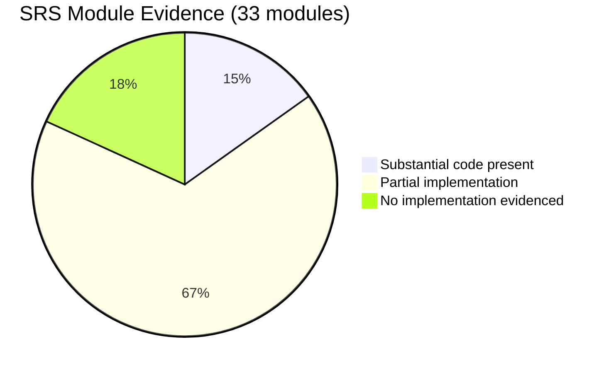
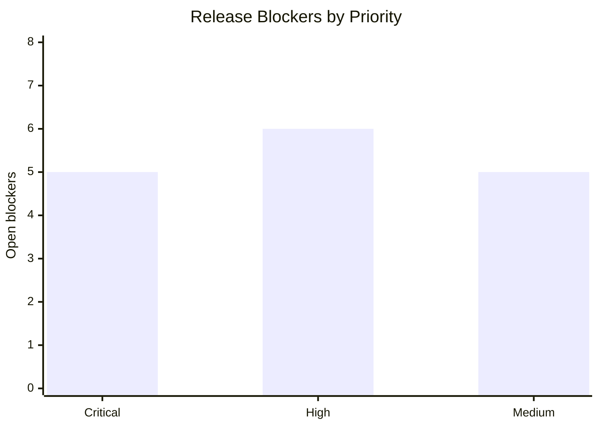
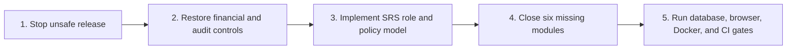

# Asha Builders ERP: SRS Gap and Production Readiness Analysis

**Assessment date:** 2026-07-13  
**SRS reviewed:** `ASHA_BUILDERS_ERP_Technical_SRS_v3.md`  
**Verdict:** **No-go for production.** Both applications compile, but release gates, compliance controls, and several mandatory SRS capabilities remain incomplete or unverified.

## Scope and Evidence

This review used the current working tree, the supplied SRS, source inspection, and the available automated checks. The working tree contains extensive uncommitted changes; none were modified by this assessment.

Docker Desktop was unavailable and no API process was reachable at `http://localhost:4000/api/health`. Therefore database-backed API E2E, browser workflow, and Docker deployment validation are **blocked**, not passed.

## Test and Build Results

| Gate | Result | Evidence |
|---|---|---|
| API production build | Pass | `npm.cmd run build --workspace=apps/api` exited 0. |
| Web production build | Pass | `npm.cmd run build --workspace=apps/web` exited 0 and generated 53 routes. |
| API unit tests | Fail | 4 suites failed; 12 tests failed, 303 passed, 315 total. |
| API lint | Fail | 3,092 errors across 191 files in the API lint target. |
| Web lint | Fail | 3 errors and 226 warnings; errors are in `e2e/seed-through-ui.spec.ts` and the 2FA settings page. |
| API and web E2E | Blocked | Docker/database/API are unavailable. The API health endpoint was unreachable. |
| Docker release test | Blocked | Docker Desktop daemon is not running on this machine. |

### Failed Tests: Root Cause

The 12 unit-test failures are concentrated in tests that were not updated after recent data-model and export-flow changes. This is still a release blocker because those tests no longer protect the changed behavior.

| Area | Failure | Root cause |
|---|---|---|
| Reports KPI | 3 failures | The mock lacks `leaveRequest.count`, now used by `ReportsService`. |
| Reports export | 2 failures | The service now delegates to `ExportOrchestrationService`, but the test still expects the former inline CSV lifecycle. |
| EMS analytics | 5 failures | The mock lacks the new `attendanceDayAggregate.findMany` dependency. |
| Attendance dashboard projector | 1 failure | The mock lacks `employee.count`. |
| Task comments | 1 failure | The expectation still uses old Prisma relation names (`author.user`) rather than `employees.users`. |

## SRS Coverage

The labels below are evidence-based code coverage, not acceptance confirmation. “Substantial code” means a corresponding API and/or UI exists; it has not been fully proven by running all business workflows.

### Substantial Code Present

1. Approval workflows
2. Material inward
3. Performance analytics
4. CRM lead pipeline
5. Feedback and complaints

### No Implementation Evidenced

1. Agreement management
2. Project profitability and owner P&L
3. Recruitment pipeline
4. Training and SOP library
5. Asset management
6. Meeting management and task conversion

### Partial SRS Modules

Employee management, task accountability, warnings, attendance, location evidence, EOD reporting, owner dashboard, leave, payroll, expense claims, vendors, accounts, inventory, quotation security, audit/compliance, communication/documents, incentives/commission, construction site management, payment collection, site labour, photo timeline, and Google Sheets export all have code present but miss one or more required controls, workflows, roles, retention rules, or production verification.

## Production Blockers and SRS Gaps

| Priority | Gap | SRS impact | Evidence |
|---|---|---|---|
| Critical | Audit and security records are permanently deleted after three months instead of archived. | Sections 12, 16, and 17 require protected retention and S3 archiving. | `log-archive.job.ts` calls `deleteMany` for activity logs and security events without archive export or deletion audit. |
| Critical | Payment records can be edited or hard-deleted by Admin, without Owner deletion authorization, audit evidence, or recalculation of booking payment status. | Sections 4, 12, and 14 require controlled financial access, protected payment records, and auditable deletion. | `payment-entries.controller.ts` permits `ADMIN`; `payment-entries.service.ts` directly updates/deletes entries. |
| Critical | Four mandatory operational roles do not exist: Accounts, Manager, Team Lead, and Field Employee. | Section 4 requires eight roles and role/team/staff-type controls on every endpoint. | `UserRole` contains only Owner, Admin, HR Manager, and Employee. |
| Critical | Mandatory 2FA is not enforced by role. | Section 2 requires 2FA for Owner, Admin, and Accounts. | Login requests 2FA only when `user.totpEnabled` is already true; Accounts role is absent. |
| Critical | Private file access is not implemented as required. | Section 3 requires private S3 objects and signed URLs. | `S3StorageProvider` returns a constructed public URL and has no signed-download implementation. |
| High | The release pipeline is not deployable as verified production infrastructure. | Section 17 requires AWS staging/production, backups, and GitHub CI/CD. | Docker is unavailable for validation; no GitHub workflow is present; backup/restore and secret rotation are unchecked release gates. |
| High | Docker Compose contains a default production seed administrator email and password. | Section 17 prohibits insecure deployment controls and requires production secrets. | `docker-compose.yml` embeds `admin@acmerealestate.com` and `SomeSecurePassword@123`. |
| High | Validation does not meet the locked API standard. | Section 15 requires Zod validation for every write request. | The application uses `class-validator` DTOs and some attendance endpoints accept `@Body() body: any`. |
| High | The project includes out-of-scope portal and WhatsApp-related functionality. | Section 18 explicitly excludes Client/Dealer/Broker portals and WhatsApp integrations. | `PortalsModule`, brokers/dealers dashboard pages, and WhatsApp-related code are in the working tree. |
| High | Project profitability/P&L, agreement management, recruitment, training/SOP, asset, and meeting modules are missing. | Sections 5 and 13 require all 33 modules in the single delivery. | No corresponding implementation modules, dashboard routes, or data models were evidenced. |
| Medium | Inventory supports inward stock but lacks a complete consumption/issue/transfer ledger and reconciliation path. | Sections 13 and 14 require stock, wastage, transfers, snapshots, and alerts. | Material inward and inventory are present; no Material Outward/Issue or inventory transaction model was evidenced. |
| Medium | Audit/deletion governance is inconsistent across modules. | Section 12 requires Owner authorization, reason, timestamp, user, approval, and retained audit for deletion. | Many service methods call Prisma `delete`/`deleteMany` directly; the shared deletion service is not consistently used. |
| Medium | Sensitive export authorization is incomplete at the business-role level. | Section 11 requires export scope for Accounts, Manager, Team Lead, and Employee. | Those roles do not exist, so team-only and accounts-only export policy cannot be enforced. |
| Medium | SRS technology deviations need an approved change record. | Section 3 specifies Redis, Socket.io, private S3, FCM/SES, CloudWatch, and AWS deployment. | The project uses SSE for realtime; CloudWatch/AWS deployment evidence is absent. |

## Recommended Remediation Order

1. Remove embedded production credentials; make Docker Compose consume only required secret variables; add a real migration/deploy gate and CI workflow.
2. Replace destructive audit/security archive cleanup with immutable S3 archive records and retention metadata. Block direct deletion of protected financial, payroll, warning, approval, audit, and security records.
3. Add Accounts, Manager, Team Lead, and Field Employee roles. Introduce policy checks that evaluate company, role, department, team, staff type, resource owner, and Owner-granted exceptions in one place.
4. Enforce TOTP setup for Owner, Admin, and Accounts before issuing a session. Include refresh-token issuance in the successful 2FA branch.
5. Make S3 objects private; issue short-lived signed download/upload URLs and record every sensitive download.
6. Fix payment-entry updates/deletions transactionally: recalculate booking totals/status, make removal an approved reversal, and write immutable finance/audit records.
7. Replace ad-hoc write validation with a shared Zod validation layer and typed request contracts. Keep generated OpenAPI documentation from the same schemas.
8. Complete the six missing modules and the partial construction/inventory, payroll, task, export, and profitability workflows.
9. Repair tests and lint first, then run E2E against an isolated test database, followed by Docker and browser release tests.

## Better Implementation Approaches

| Current approach | Better approach | Why it is safer and easier to evolve |
|---|---|---|
| Role checks scattered across controller decorators plus a small static permission list. | Central policy engine with typed `can(action, resource, context)` checks and explicit team/department scopes. | Supports the SRS role matrix, Owner grants, employee ownership, and future modules without duplicating rules. |
| Direct Prisma reads/writes inside most services. | Repository layer per domain, with mandatory `companyId` scope injected by the repository constructor/query helper. | Makes tenant isolation testable by default and matches the SRS module-boundary rule. |
| Exports were moved to an orchestration service but old service tests remain. | Define an `ExportRunner` interface, mock that interface in unit tests, and add an integration test for report-to-export orchestration. | Prevents refactors from silently invalidating test doubles and keeps export policy independent from file generation. |
| Scheduled archive job deletes rows. | Append-only archive pipeline: write signed archive manifest, upload encrypted payload to private S3, verify checksum, then mark records archived. | Preserves legal/audit evidence and allows retention policy without data destruction. |
| Payment edits and deletes operate directly on rows. | Ledger/reversal model: immutable payment entries plus compensating reversal records, all within a transaction. | Preserves financial history and prevents booking status drift. |
| Upload provider returns a public-style object URL. | Private-object storage service with signed URLs, content scanning, object ownership metadata, and download audit hooks. | Meets quotation/document confidentiality requirements. |
| `class-validator` DTOs and `any` request bodies. | Shared Zod schemas used by API validation, inferred TypeScript types, and frontend forms. | Implements the SRS standard and removes schema drift between web and API. |

## Acceptance Evidence Still Required

- A clean database migration from a fresh PostgreSQL 16 instance.
- API E2E pass against an isolated database.
- Browser UAT for Owner, Admin, HR, Accounts, Manager, Team Lead, Employee, and Field Employee flows.
- Docker image build, compose startup, health checks, and production-seed safety verification.
- Backup creation and isolated restore test with recorded RPO/RTO evidence.
- CI/CD staging and production deployment evidence.
- Security tests for private signed file URLs, 2FA enforcement, export logging, company isolation, deletion authorization, and audit retention.

## Conclusion

The codebase is a substantial ERP foundation and both production builds currently succeed. It is not ready for production delivery under the supplied SRS: the release gates fail or are blocked, mandatory roles and modules are incomplete, and audit, financial, secret-management, and file-access controls need correction before any production data is introduced.
