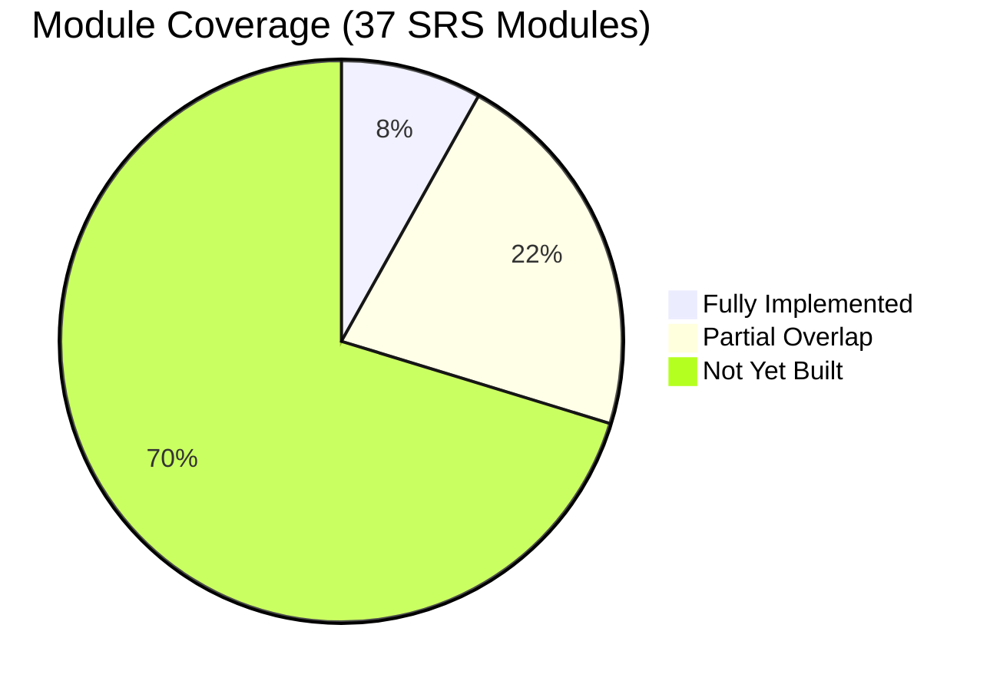
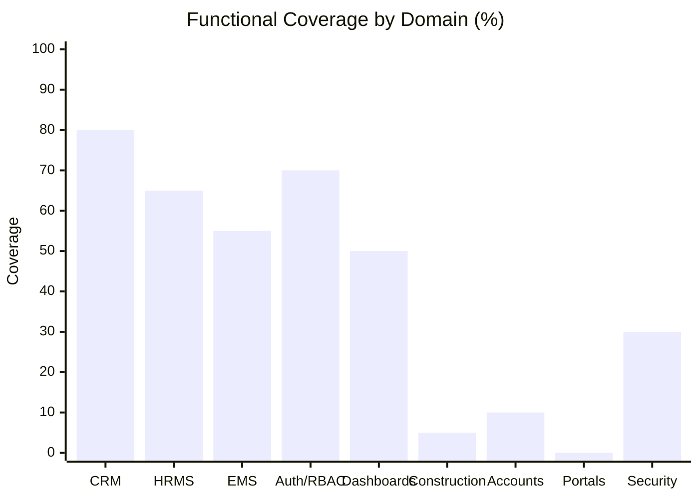
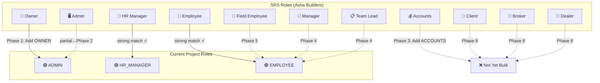
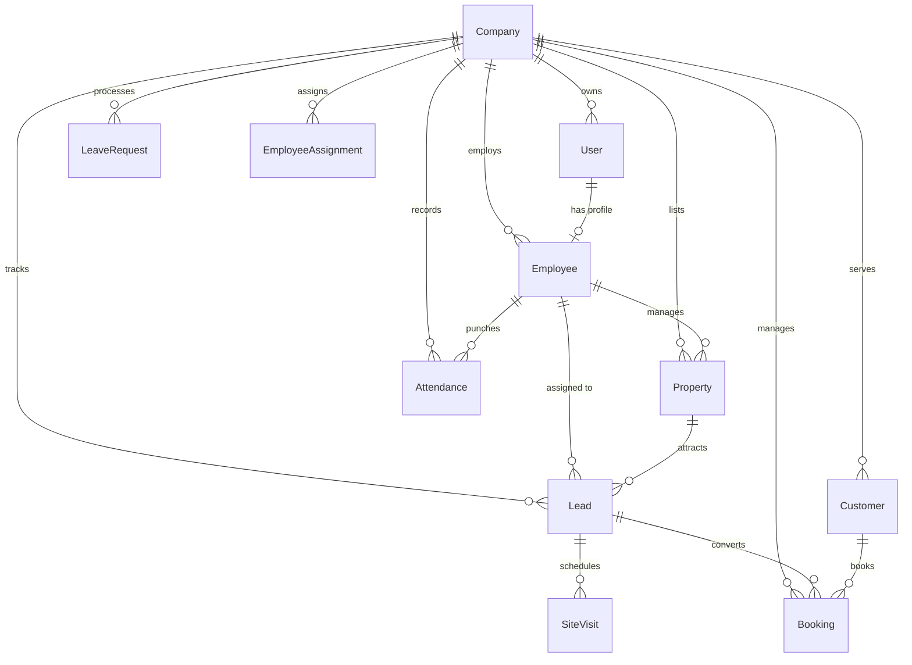
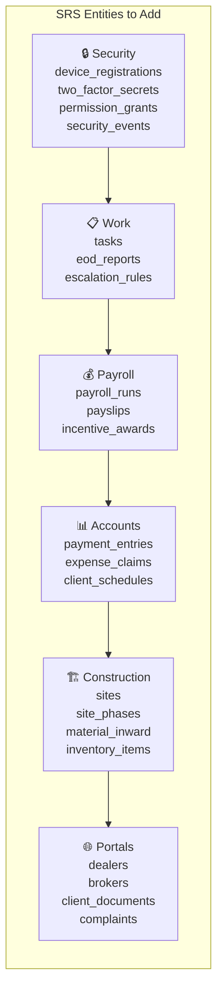
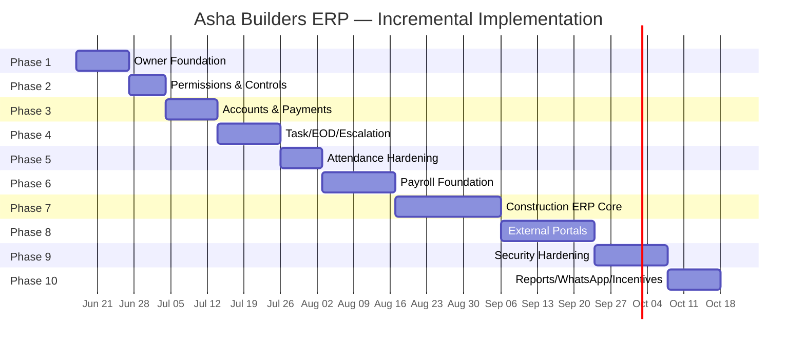
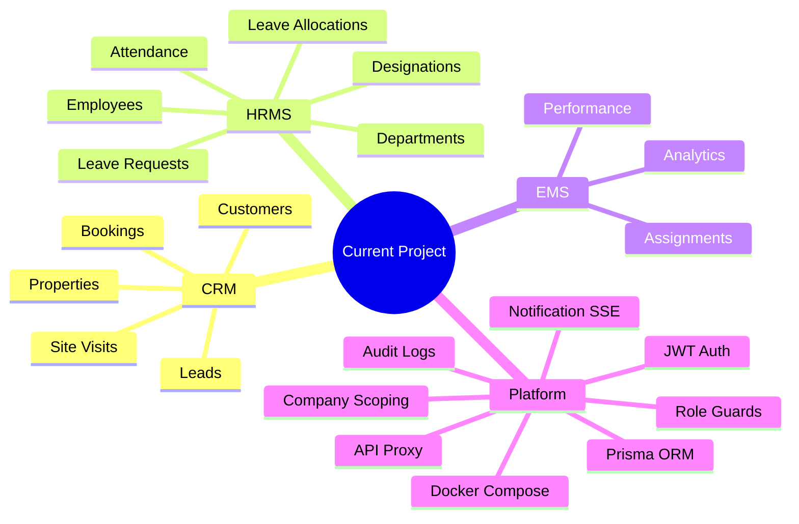
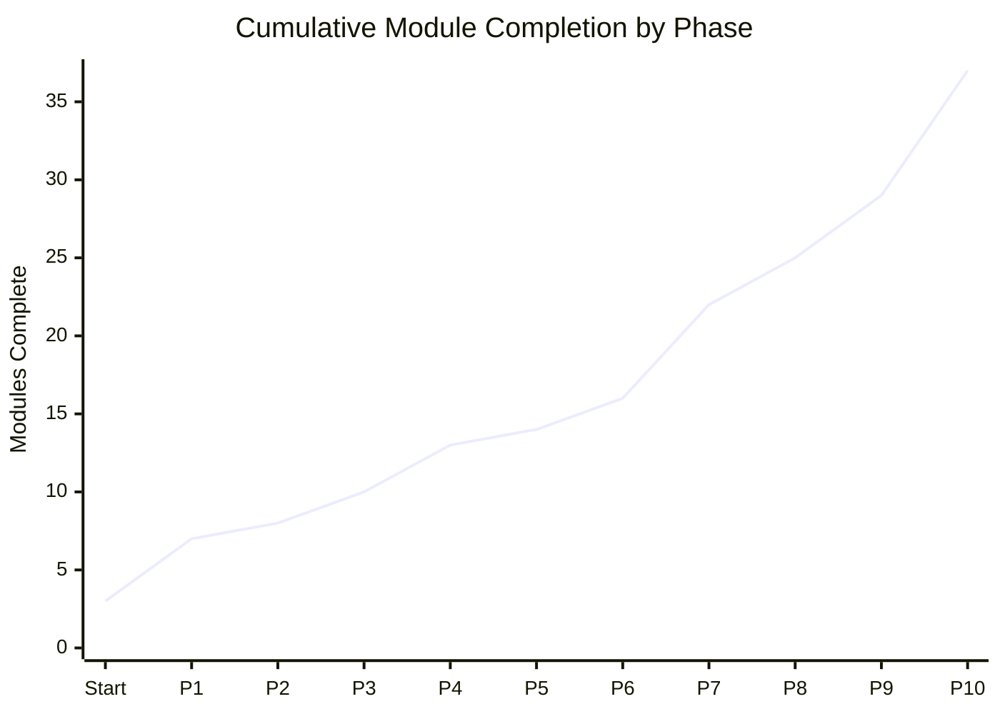

# 🏗️ Asha Builders SRS — Current Project Comparison

> **Last updated:** 2026-06-16  
> **Status:** Foundation Phase Complete — 10-Phase SRS Alignment Plan Defined

---

## 📊 Quick Status





---

## 🎯 Executive Summary

| Metric | Status |
|--------|--------|
| **Total SRS Modules** | 37 |
| **Fully Implemented** | 3 (Employee Mgmt, CRM Lead Pipeline, Performance Analytics) |
| **Partial Overlap** | 8 (Task Mgmt, Attendance, Leave, Owner Dashboard, Audit, Accounts, Reports, Notifications) |
| **Not Yet Built** | 26 |
| **Total Lines of Code** | ~51k (Git baseline `f1a88ea`) |
| **Architecture** | Next.js 16 + NestJS 11 + Prisma 7.8 + PostgreSQL 16 🟢 |

**Verdict:** Strong full-stack foundation. Not yet the complete Asha Builders 37-module ERP. Requires 10 incremental phases to close the gap without breaking existing functionality.

---

## 🧩 Role Mapping



---

## 📋 Module-by-Module Gap Matrix

### ✅ Fully Implemented (3/37)

| # | Module | Status | Coverage |
|---|--------|--------|----------|
| 1 | **Employee Management** | ✅ Complete | Employees, Users, Departments, Designations, hierarchy, salary field, status |
| 2 | **CRM Lead Pipeline** | ✅ Complete | Properties, Leads, Customers, Site Visits, Bookings, statuses, assignments |
| 3 | **Performance Analytics** | ✅ Complete | EMS Performance scores, Analytics dashboard, conversion funnel, team analytics |

### 🔶 Partial Overlap (8/37)

| # | Module | Status | What's Present | What's Missing |
|---|--------|--------|----------------|----------------|
| 4 | **Task Management** | ⚠️ Partial | EMS Assignments + My Tasks page | Full task comments, attachments, history, public/private tasks |
| 5 | **Attendance System** | ⚠️ Partial | Check-in/out, verify flow, statuses | Office IP, device registration, selfie/GPS, nonce evidence |
| 6 | **Leave Management** | ⚠️ Partial | Requests, allocations, approvals, balances | SRS-specific medical/sick day rules, Owner approval toggle |
| 7 | **Owner Dashboard** | ⚠️ Partial | Admin dashboard with KPIs/charts | No P&L, no approvals command center, no `OWNER` role |
| 8 | **Audit & Compliance** | ⚠️ Partial | Activity logs, AuditLogInterceptor | Append-only legal export, security events |
| 9 | **Accounts & Payment** | ⚠️ Partial | Booking amount + payment status | Manual ledger, vendor payments, EMI, collection tracker |
| 10 | **Reports** | ⚠️ Partial | Reports route + chart components | Scheduled PDF/Excel export, watermark, role-scoped reports |
| 11 | **Communication** | ⚠️ Partial | In-app notifications, SSE streams | Broadcast announcements, read receipts, document sharing |

### ❌ Not Yet Built (26/37)

| # | Module | Phase | Priority |
|---|--------|-------|----------|
| 12 | OWNER Role & Permissions | **Phase 1** | 🔴 Critical |
| 13 | Approval Workflows | **Phase 1** | 🔴 Critical |
| 14 | Company Settings | **Phase 1** | 🔴 Critical |
| 15 | Permission Grants/Toggles | **Phase 2** | 🔴 Critical |
| 16 | Payment Collection Tracker | **Phase 3** | 🟠 High |
| 17 | Manual Payment Entries | **Phase 3** | 🟠 High |
| 18 | Daily EOD Reporting | **Phase 4** | 🟠 High |
| 19 | Escalation Matrix | **Phase 4** | 🟠 High |
| 20 | Attendance Hardening | **Phase 5** | 🟡 Medium |
| 21 | Attendance Corrections | **Phase 5** | 🟡 Medium |
| 22 | Payroll Automation | **Phase 6** | 🟡 Medium |
| 23 | Vendor & Contractor | **Phase 7** | 🟡 Medium |
| 24 | Material Inward | **Phase 7** | 🟡 Medium |
| 25 | Inventory Management | **Phase 7** | 🟡 Medium |
| 26 | Construction Sites | **Phase 7** | 🟡 Medium |
| 27 | Site Labour Management | **Phase 7** | 🟢 Low |
| 28 | Photo Progress Timeline | **Phase 7** | 🟢 Low |
| 29 | Client Portal | **Phase 8** | 🟢 Low |
| 30 | Broker Portal | **Phase 8** | 🟢 Low |
| 31 | Dealer Portal | **Phase 8** | 🟢 Low |
| 32 | 2FA/TOTP | **Phase 9** | 🟢 Low |
| 33 | File Policy & S3 | **Phase 9** | 🟢 Low |
| 34 | Audit Export | **Phase 9** | 🟢 Low |
| 35 | Reports Export Center | **Phase 10** | 🟢 Low |
| 36 | WhatsApp Automation | **Phase 10** | 🟢 Low |
| 37 | Incentive/Commission | **Phase 10** | 🟢 Low |

---

## 🏛️ Architecture Comparison

| Layer | SRS Expectation | Current Project | Delta |
|-------|----------------|----------------|-------|
| **Frontend** | Next.js 14, TypeScript, App Router, Tailwind, PWA | Next.js **16** ✅, TypeScript ✅, App Router ✅, Tailwind ✅ | PWA/offline missing, but framework is newer |
| **Backend** | Node 20, Express, TypeScript | NestJS **11** on Express ✅ | Different framework, structured & production-ready |
| **Database** | PostgreSQL 16 + Prisma | PostgreSQL ✅ + **Prisma 7.8** ✅ | Strong match |
| **Cache/Queue** | Redis 7 | ❌ Not present | Needed for queue/rate limiting |
| **Realtime** | Socket.io | SSE module present ⚠️ | Functional but not Socket.io |
| **File Storage** | AWS S3 + signed URLs | Local upload endpoints ⚠️ | S3 abstraction needed |
| **Notifications** | FCM + SES + WhatsApp BSP | In-app SSE notifications ⚠️ | External channels missing |
| **Monitoring** | Sentry + CloudWatch | Logger/runbook ⚠️ | Integration missing |
| **Deployment** | AWS staging/prod + CI/CD | Docker Compose ✅ | AWS/CI not complete |

---

## 🗺️ Data Model — Current vs SRS

### Current Domain Model (Existing)



### SRS Entities Not Yet Present



---

## 🛣️ 10-Phase Roadmap



---

## ✅ Current Project Strengths (Keep & Preserve)



---

## 🔧 Phase 1 — Owner Foundation (Detailed)

### Scope
Make the app **owner-demo-ready** without breaking existing admin/hr/employee flows.

### Tasks

1. **Add `OWNER` role** to Prisma enum, guards, session typing
2. **Add Owner label/navigation** — sidebar visibility for OWNER
3. **Add Owner Dashboard** — reuse existing analytics APIs
4. **Add Approval Center** — `/dashboard/approvals` route
5. **Add Company Settings foundation** — attendance rules, notification toggles
6. **Add production-safe sample data** — demo users + seed data
7. **Update documentation** — TRACKER.md, phase checklist, SRS comparison

### Demo Users

| Email | Password | Role |
|-------|----------|------|
| `owner@company.com` | `Owner@12345` | `OWNER` |
| `admin@company.com` | `Admin@123` | `ADMIN` |
| `hr@company.com` | `Hr@12345` | `HR_MANAGER` |
| `sales@company.com` | `Sales@12345` | `EMPLOYEE` |
| `agent@company.com` | `Agent@12345` | `EMPLOYEE` |
| `ops@company.com` | `Ops@12345` | `EMPLOYEE` |

### Verification
```sh
npm run prisma:generate --workspace=apps/api
npm run lint:all
npm run build --workspace=apps/api
npm run build --workspace=apps/web
npm run test --workspace=apps/api -- --runInBand
npm run test:e2e --workspace=apps/api
npm run test:e2e --workspace=apps/web
```

Plus browser verification: sign-in as owner → dashboard loads → sidebar links work → approval center loads → existing accounts still work.

---

## 📈 SRS Progress Tracker



---

*This document tracks the gap between the current RealEstate CRM project and the Asha Builders Technical SRS (37-module ERP). Update after each phase completion.*
